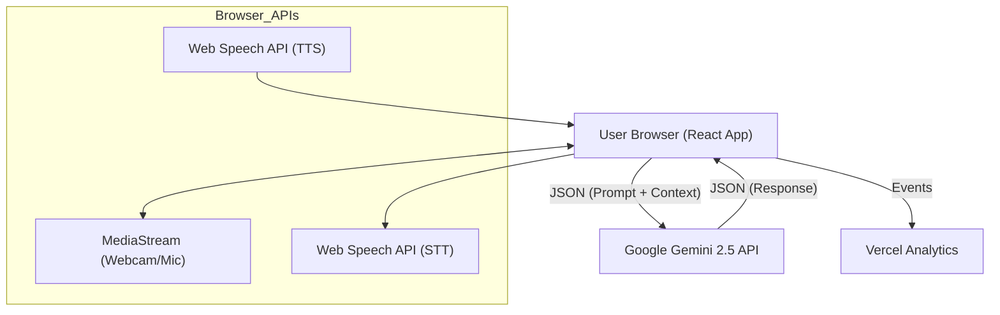

# System Design Document: EasyInterview

**Version:** 1.0  
**Status:** Draft  
**Last Updated:** 2026-02-04

---

## 1. Introduction
This document allows engineers to understand the architectural decisions, component interactions, and data flows within the EasyInterview platform. The system is designed as a **Client-Side Heavy / Serverless** application, relying on browser APIs for media processing and Google's Gemini API for intelligence.

## 2. System Architecture

### 2.1 High-Level Architecture
The application runs entirely within the user's browser (React Client), communicating directly with external APIs. There is no traditional backend middleware for media processing, ensuring low latency and privacy.

### 2.2 Core Modules
1.  **UI Controller (React Router):** Manages the flow between Home -> Setup -> Interview -> Feedback.
2.  **Hardware Manager (Hooks):** Custom hooks (`useMediaStream`, `useSpeechRecognition`) to encapsulate browser API complexity.
3.  **AI Orchestrator (Service):** A service layer that constructs prompts for Gemini, managing the "Context Window" (Resume + Job Description + Conversation History).
4.  **Feedback Engine:** Analyzes raw metrics and generates the final report.

## 3. Data Flow

### 3.1 The "Speak-Listen-Reply" Loop (Interview Mode)
1.  **Input:** User speaks into the microphone.
2.  **Transcription:** `window.SpeechRecognition` converts audio to text string in real-time.
3.  **Silence Detection:** A timer detects pause (> 2.0s silence).
4.  **Processing:**
    *   The transcript is appended to the `conversationHistory`.
    *   A prompt is sent to Gemini: `Context: {Resume, JD} | History: [...] | User Said: "..."`
5.  **AI Response:** Gemini returns a text response + internal logic/score.
6.  **Output:** `window.speechSynthesis` speaks the response (Text-to-Speech) using the "Ava" voice profile.

### 3.2 The "Visual Watchdog" Loop (Background Process)
1.  **Capture:** A hidden `<canvas>` captures a frame from the `<video>` element every 500ms.
2.  **Analysis:** The frame is passed to a lightweight logic layer (or Vision API).
    *   *Check 1:* Is face centered? (Bounding box check)
    *   *Check 2:* Are eyes open/looking forward?
3.  **Trigger:** If `Score < Threshold` for 3 consecutive frames, dispatch a Toast Notification (e.g., "Main Eye Contact").

## 4. Component Design (React)

### 4.1 Key Components
*   `App.tsx`: The main specific state holder (UserDetails, Transcript).
*   `SetupStep.tsx`: Handles file uploads (Resume) and permissions check.
*   `InterviewStep.tsx`: The most complex component. Contains:
    *   Split-screen layout (AvatarVideo | UserWebcam).
    *   Real-time transcription log.
    *   `useEffect` hooks for managing the Speech-Response cycle.
*   `FeedbackStep.tsx`: Renders the Recharts Radar chart and markdown feedback.

### 4.2 State Management
We use **Local State (useState)** lifted to `App.tsx` for global session data, avoiding Redux complexity for this single-user flow.

*   `userDetails`: `{ name, role, resumeText, jobDescription }`
*   `transcript`: `Array<{ sender: 'AI'|'User', text: string, timestamp: number }>`
*   `scores`: `Array<{ metric: string, value: number, reason: string }>`

## 5. API Design

### 5.1 Gemini Prompt Engineering
The system relies heavily on "System Instructions" sent to Gemini.
**System Prompt Template:**
> "You are Ava, a professional technical recruiter. You are interviewing {Name} for the role of {Role}.
> Based on the resume provided below, ask relevant questions.
> Maintain a professional but encouraging tone.
> Do NOT break character.
> Resume Content: {Content}..."

### 5.2 External Dependencies
*   **Google GenAI SDK:** For communicating with the model.
*   **Lucide React:** For consistent iconography.
*   **Vercel Analytics:** For privacy-friendly page view tracking.

## 6. Security & Privacy

### 6.1 Data Persistence
*   **No Database:** User data is ephemeral. Refreshing the page wipes the session (by design, for privacy).
*   **Local Processing:** Audio is transcribed in-browser; raw audio files are never uploaded.

### 6.2 API Security
*   **Environment Variables:** `VITE_GEMINI_API_KEY` is used. In production, a proxy function (Edge Function) is recommended to hide this key from the client bundle.

## 7. UX/UI Guidelines
*   **Color Palette:** Indigo (`#4F46E5`) for primary actions, Slate (`#64748B`) for text.
*   **Typography:** Sans-serif (Inter/system-ui) for readability.
*   **Feedback:** All interactive elements must have hover states. AI thinking states must show a "Thinking..." or "Listening..." visual indicator.
